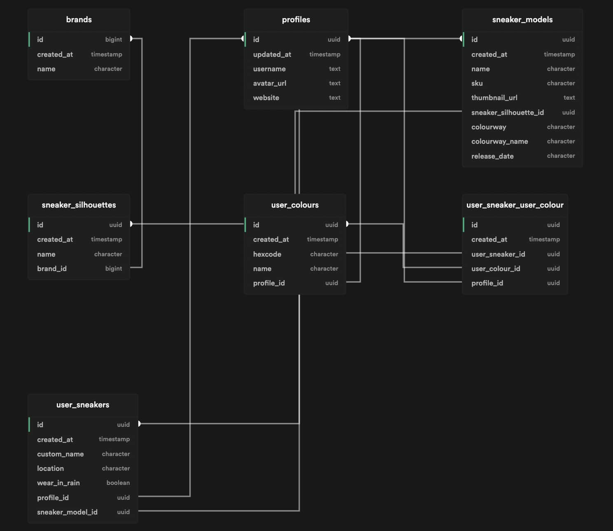

# Nothing To Wear

## What is this app?
Do you have a sneaker addiction like I do? Is the size of your growing sneaker collection starting to scare you?

If so, Nothing To Wear might just be the app for you!

Living in a small apartment, I've had to store my sneakers in different bags, boxes, suitcases, and shelves across the apartment. When I'm trying to assemble together an outfit and I have the perfect pair envisioned in my mind, I sometimes find it impossible to remember where I stored it. Sometimes I even forget what pairs I already own!

Nothing To Wear is a PWA that does the following:
1. Allows you to add sneakers into your collection using images and data from StockX. No need to go through the hassle of taking pictures of the shoes, or filling in the SKU and other boring data!
2. Allows you to add a custom name and location notes to your sneakers (To search with)
3. Allows you to set whether you want to wear this sneaker in the rain or not (To filter with)
4. Allows you to create user-specific colours, and set colours to sneakers (To filter with)
5. In the end you're able to go through your collection, filter them by colour, brand, name, etc.

## How can I use this?
Does this sound good to you? Currently I've built only an MVP for my personal use (and a few friends), so if you'd like to try it out feel free to DM me for an invite.

For now if you're curious how it looks you can look at these quick demos I made:

<video src="./public/showcase_browse.mp4" controls="controls" style="max-width: 730px;">
</video>
<video src="./public/showcase_filter.mp4" controls="controls" style="max-width: 730px;">
</video>
<video src="./public/showcase_add.mp4" controls="controls" style="max-width: 730px;">
</video>
  
## How did you build this?
Nothing To Wear was built with NextJS and Supabase, currently using the [Sneaks-API](https://github.com/druv5319/sneaks-app) to fetch the sneaker related data.

If you're curious about the schema, check it out below courtesy of [Supabase Schema](https://github.com/zernonia/supabase-schema)

